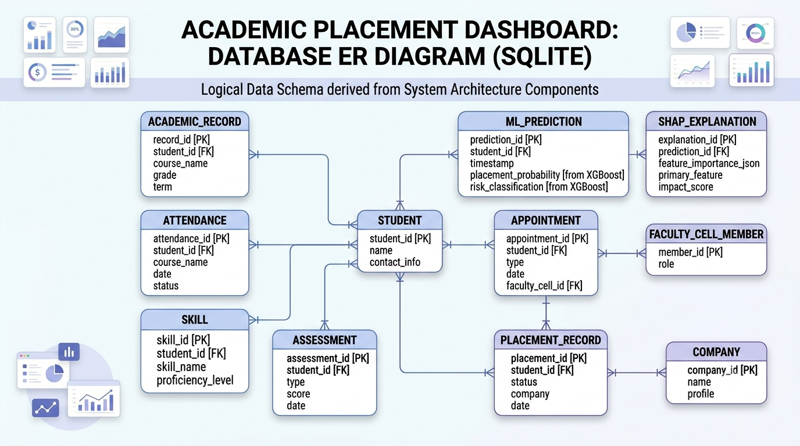
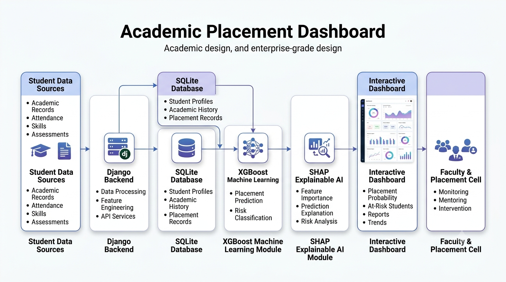

# Academic Placement Dashboard

## Project Overview
This project is an advanced **Academic Placement Dashboard** designed to bridge the gap between academic performance and placement success. Using **Machine Learning (XGBoost)**, the system predicts student placement probability, while **Explainable AI (SHAP)** provides transparent insights into the underlying factors influencing these predictions.

## Objectives
- To identify students at risk of underperformance early in their academic journey.
- To provide actionable insights to faculty for personalized student intervention.
- To maintain a transparent and interpretable prediction model for student outcomes.

## Key Modules
1. **Student Data Management:** Centralized database for academic records and performance metrics.
2. **Predictive Analytics:** Implements **XGBoost** to classify students based on placement potential.
3. **XAI Interpretability:** Uses **SHAP (SHapley Additive exPlanations)** to explain model decisions (e.g., why a student is marked 'At-Risk').
4. **Interactive Dashboard:** Visual interface for faculty to monitor class performance and individual student progress.

## Tech Stack
- **Frontend:** HTML, CSS, Bootstrap
- **Backend:** Django
- **Machine Learning:** Scikit-learn, XGBoost, SHAP
- **Database:** SQLite

## Project Architecture

## Installation & Usage
1. Clone this repository: `git clone https://github.com/hemavelusamy/Academic_Placement_Dashboard.git`
2. Install dependencies: `pip install -r requirements.txt`
3. Run the application: `python manage.py runserver`

## Future Scope
- Integration of real-time student attendance monitoring.
- Implementation of automated email alerts for at-risk students and faculty.
